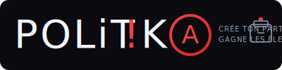

<p align="center">
  
</p>

<h1 align="center">POLiT!K<span style="border:2px solid #ef4444;border-radius:50%;padding:2px 6px;">A</span></h1>

<p align="center">
  <strong>🗳️ Crée ton parti, gagne les élections</strong><br>
  Plateforme citoyenne d'éducation populaire et d'empowerment politique
</p>

<p align="center">
  <a href="#-démo">Démo</a> •
  <a href="#-fonctionnalités">Fonctionnalités</a> •
  <a href="#-installation">Installation</a> •
  <a href="#-modules">Modules</a> •
  <a href="#-contribution">Contribution</a> •
  <a href="#-licence">Licence</a>
</p>

<p align="center">
  
  
  
  
</p>

---

## 🎯 Vision

**POLiT!KA** est une plateforme low-tech conçue pour accompagner les citoyens dans leur parcours d'engagement politique — de la simple curiosité jusqu'à la création de leur propre mouvement politique.

```
🌱 Citoyen éveillé → 📚 Formé → 🤝 Organisé → 🏛️ Candidat → 👑 Élu
```

### Pourquoi POLiT!KA ?

- **🔓 100% Open Source** — Tout est transparent, modifiable, réappropriable
- **📴 Fonctionne hors-ligne** — Pas besoin d'internet une fois téléchargé
- **🪶 Ultra-léger** — Fichiers HTML autonomes, zéro dépendance
- **🇧🇪 Focus Belgique** — Données politiques belges vérifiées
- **🎮 Gamifié** — Progression XP, niveaux, succès
- **🎨 Personnalisable** — 7 thèmes, 12 presets partis politiques

---

## 🚀 Démo

**[▶️ Lancer POLiT!KA](https://votre-username.github.io/politika/)** *(GitHub Pages)*

Ou téléchargez simplement `index.html` et ouvrez-le dans votre navigateur !

<p align="center">
  
</p>

---

## ✨ Fonctionnalités

### 🏠 Hub Central
- **Compte à rebours électoral** — Toutes les échéances belges (communales, régionales, fédérales, européennes)
- **Système de progression** — XP, niveaux, du "Citoyen éveillé" au "Leader national"
- **Actions rapides** — Accès direct aux modules essentiels
- **Import/Export** — Sauvegarde et restauration de toutes vos données

### 🎨 Personnalisation avancée
| Catégorie | Options |
|-----------|---------|
| Thèmes | Sombre, Clair, Minuit, Océan, Nature, Sunset, Sépia |
| Accents | 9 couleurs (Rouge, Bleu, Vert, Violet, Orange, Rose, Cyan, Jaune, Indigo) |
| Partis | PS, MR, Ecolo, PTB, Les Engagés, DéFI, N-VA, Vooruit, Groen, Open VLD, CD&V, VB |
| Texte | 4 tailles (Petit → Très grand) |
| Layout | Confortable / Compact |

### 📦 12 Modules intégrés

| Module | Description | Catégorie |
|--------|-------------|-----------|
| 🇧🇪 **BELDATA** | Tous tes élus à tous les niveaux | Apprendre |
| 🧠 **Flashcards** | Quiz interactifs sur les institutions | Apprendre |
| 👥 **L'iNTRO!** | Profils et projets solidaires | Réseauter |
| 🏪 **L'iSTORE!** | Catalogue de ressources | Organiser |
| 📋 **Kanban** | Gestion de projets | Organiser |
| 🔍 **Panopticon** | Cartographie des réseaux de pouvoir | Réseauter |
| 📇 **Répertoire EP** | Associations d'éducation permanente | Réseauter |
| 🎮 **L'ASCENSION** | Jeu narratif stratégique | S'amuser |
| ⭐ **L'ÉTOILE NOIRE** | ARG épique Matrix/Star Wars | S'amuser |
| 🔨 **Forge Studio** | Création de documents | Organiser |
| 🎯 **WarGames** | Simulation stratégique | S'amuser |
| 🤝 **SYNERGY** | Jeu coopératif inter-associatif | S'amuser |

---

## 📥 Installation

### Option 1 : Téléchargement direct (recommandé)

```bash
# Cloner le repo
git clone https://github.com/votre-username/politika.git

# Ouvrir le hub
open politika/index.html
```

### Option 2 : GitHub Pages

1. Fork ce repository
2. Activez GitHub Pages dans Settings → Pages
3. Accédez à `https://votre-username.github.io/politika/`

### Option 3 : Fichier unique

Téléchargez simplement `index.html` — tout est inclus dedans !

---

## 📂 Structure du projet

```
politika/
├── index.html              # 🏠 Hub central POLiT!KA
├── README.md               # 📖 Documentation
├── LICENSE                 # ⚖️ Licence MIT
├── CONTRIBUTING.md         # 🤝 Guide de contribution
│
├── modules/                # 📦 Modules HTML autonomes
│   ├── intro.html          # L'iNTRO! - Profils & projets
│   ├── istore.html         # L'iSTORE! - Catalogue
│   ├── flashcards.html     # Flashcards - Quiz
│   ├── kanban.html         # Kanban - Gestion projets
│   ├── panopticon.html     # Panopticon - Graphe réseau
│   ├── repertoire-ep.html  # Répertoire EP
│   ├── ascension.html      # L'ASCENSION - Jeu narratif
│   ├── etoile-noire.html   # L'ÉTOILE NOIRE - ARG
│   └── ...
│
├── data/                   # 💾 Données JSON
│   ├── kern-schema.json    # Schéma de données unifié
│   ├── belgique-2026.json  # Données politiques belges
│   └── demo-data.json      # Données de démonstration
│
├── docs/                   # 📚 Documentation
│   ├── screenshots/        # Captures d'écran
│   ├── ARCHITECTURE.md     # Architecture technique
│   ├── DATA-FORMAT.md      # Format des données
│   └── MODULES.md          # Documentation des modules
│
└── assets/                 # 🎨 Ressources
    ├── logo.svg            # Logo POLiT!KA
    └── icons/              # Icônes
```

---

## 🔧 Architecture technique

### Principes fondamentaux

| Principe | Description |
|----------|-------------|
| **Low-tech** | HTML/CSS/JS vanilla, zéro framework |
| **Autonome** | Chaque fichier fonctionne seul |
| **Offline-first** | Tout en localStorage |
| **Interopérable** | Format JSON standardisé |
| **Accessible** | WCAG 2.1 AA visé |

### Format de données unifié

Tous les modules utilisent le même schéma (`kern-schema.json`) :

```json
{
  "version": 2,
  "updated": "2026-01-07",
  "meta": {
    "platform": "KERN / POLiT!KA",
    "author": "Collectif"
  },
  "profiles": [],
  "projects": [],
  "entities": [],
  "decks": [],
  "boards": []
}
```

### Stockage

```javascript
// Chaque module a sa clé localStorage
localStorage.getItem('politika_data')     // Hub central
localStorage.getItem('intro_data')        // L'iNTRO!
localStorage.getItem('flashcards_data')   // Flashcards
localStorage.getItem('kanban_data')       // Kanban
// ...
```

---

## 🗳️ Élections belges (échéances)

| Élection | Date | Jours restants* |
|----------|------|-----------------|
| 🇪🇺 Européennes | 10 juin 2029 | ~1250 |
| 🇧🇪 Fédérales | 10 juin 2029 | ~1250 |
| 🗺️ Régionales | 10 juin 2029 | ~1250 |
| 🏘️ Communales | 11 octobre 2030 | ~1370 |

*Calculé automatiquement par le hub

---

## 🤝 Contribution

Les contributions sont les bienvenues ! Voir [CONTRIBUTING.md](CONTRIBUTING.md) pour les détails.

### Idées de contribution

- 🌍 **Traductions** — Néerlandais, allemand, anglais
- 📊 **Données** — Mise à jour des données politiques
- 🎨 **Thèmes** — Nouveaux thèmes visuels
- 📦 **Modules** — Nouveaux outils citoyens
- 🐛 **Bugs** — Signalement et corrections
- 📖 **Documentation** — Amélioration des guides

### Développement local

```bash
# Aucune installation requise !
# Ouvrez simplement les fichiers HTML dans votre navigateur

# Pour un serveur local (optionnel)
python -m http.server 8000
# ou
npx serve .
```

---

## 📊 Roadmap

### Version 2.1 (Q1 2026)
- [ ] Mode PWA (Progressive Web App)
- [ ] Synchronisation entre appareils (via GitHub Gist)
- [ ] Module "Créateur de programme électoral"

### Version 2.2 (Q2 2026)
- [ ] Traduction NL/DE/EN
- [ ] Données provinciales complètes
- [ ] Module "Simulateur de scrutin"

### Version 3.0 (2027)
- [ ] Backend léger optionnel (Supabase)
- [ ] Fonctionnalités collaboratives
- [ ] API publique

---

## 📜 Licence

Ce projet est sous licence **MIT** — voir le fichier [LICENSE](LICENSE) pour plus de détails.

Vous êtes libre de :
- ✅ Utiliser commercialement
- ✅ Modifier
- ✅ Distribuer
- ✅ Utiliser en privé

---

## 🙏 Crédits

### Équipe
- Conception & développement : Collectif citoyen

### Technologies
- Fonts : [Inter](https://rsms.me/inter/), [Bebas Neue](https://fonts.google.com/specimen/Bebas+Neue)
- Icons : Emojis natifs
- Inspiration : Éducation populaire belge

### Données
- [Parlement Wallon](https://www.parlement-wallonie.be)
- [Chambre des Représentants](https://www.lachambre.be)
- [Parlement européen](https://www.europarl.europa.eu)
- [Belgium.be](https://www.belgium.be)

---

## 📞 Contact

- 🐛 **Issues** : [GitHub Issues](https://github.com/votre-username/politika/issues)
- 💬 **Discussions** : [GitHub Discussions](https://github.com/votre-username/politika/discussions)
- 📧 **Email** : contact@politika.be

---

<p align="center">
  <strong>POLiT!K(A)</strong> — De citoyen à candidat victorieux 🗳️
  <br><br>
  <sub>Fait avec ❤️ pour la démocratie belge</sub>
</p>
